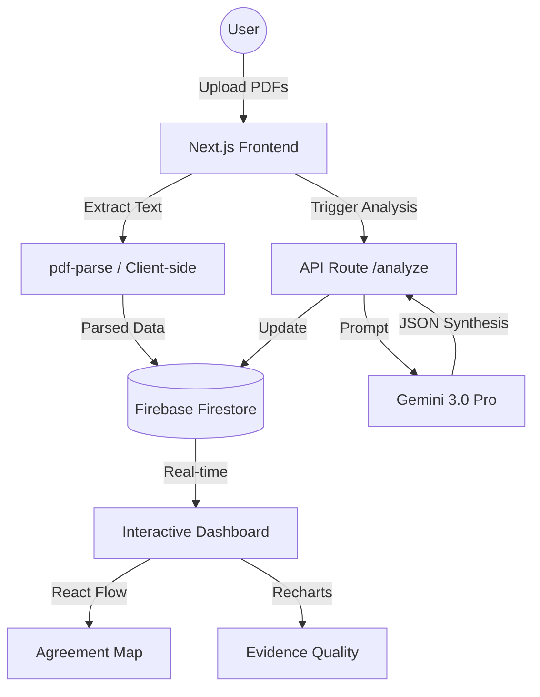

# EvidenceSynthesis 🔬

AI-Powered Cross-Document Research Analysis platform designed to bridge the gap between raw data extraction and meaningful cross-document synthesis.

## 🚀 Quick Start
1. **Launch Quick Demo**: Click the button on the home page to instantly load a pre-analyzed synthesis of 3 authentic research papers on **Caffeine & Cognition**.
2. **Dashboard**: Explore the Agreement Map, Contradiction Cards, and Evidence Quality charts.
3. **What If Analysis**: Toggle papers in the "What If" mode to see how global conclusions shift.

## 🏗️ Architecture

## 🛠️ Tech Stack
- **Framework**: Next.js 14 (App Router)
- **AI**: Gemini 1.5 Pro (via Google Generative AI SDK)
- **State Management**: Zustand (Sliced Pattern)
- **Data Fetching**: TanStack Query (React Query)
- **Database**: Firebase Firestore
- **Visualizations**: React Flow (Network Graph), Recharts (Radar/Bar)
- **Styling**: Tailwind CSS + Framer Motion (Animations)

## 🎯 Key Features
- **Contradiction Detection**: Identifies root causes of disagreements (methodology, dose, population).
- **Confidence Scoring**: Quantitative evidence quality scores.
- **Guided Tour**: Interactive onboarding for new researchers.
- **Zero-Wait Demo**: Pre-seeded clinical data for instant exploration.

## 📝 Description (200 words)
EvidenceSynthesis is a research intelligence platform that transforms the tedious process of literature review into an interactive, AI-driven experience. While traditional tools summarize individual papers, EvidenceSynthesis analyzes *relationships* between multiple studies on the same topic. 

Powered by Gemini 3.0 Pro, the system automatically detects quantitative claims, identifies methodological contradictions, and flags potential biases. Within 60 seconds, it constructs an "Agreement Map"—a network graph visualizing how studies concur or conflict. The platform's standout "What If" mode allows researchers to perform sensitivity analysis by exclusion, revealing how removing a single outlier study (e.g., a small sample or industry-funded trial) changes the global conclusion.

Built for the speed of modern evidence-based medicine and policy-making, EvidenceSynthesis features a high-fidelity dashboard built with Next.js, React Flow, and Recharts. It provides a "Confidence Score" for every finding, calibrated to distinguish between strong consensus and speculative trends. Whether you're a clinician reconciling conflicting trials or a student mapping a new field, EvidenceSynthesis provides the clarity needed to make data-driven decisions.

---
*Created with ❤️ by Antigravity*
